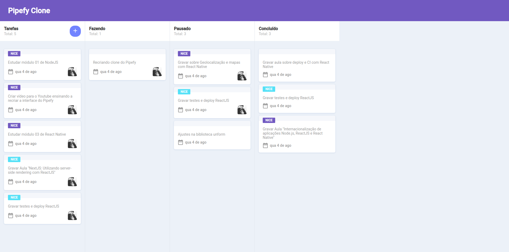

<h1 align="center" color="#fff" font-size="20px">Pipefy Clone</h1>

<p align="center">
  
  
  
  
</p>

<p align="center">
  
</p>

## 💻 Sobre o Projeto
Recriando a interface do pipefy aprendendo um pouco de nextjs e drag and drop (JS puro).

## 🚀 Tecnologias
Esse projeto foi desenvolvido com as seguintes tecnologias:

- [NextJs](https://nextjs.org/)

### Built with
```bash
yarn
yarn dev
```
---

Made with :coffee: and ❤️ by Alanderson Tomaiz.